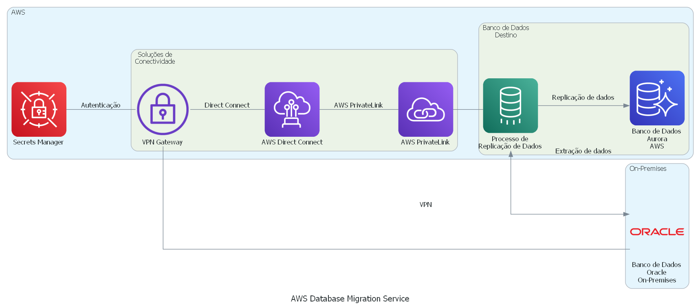
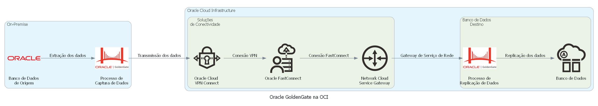
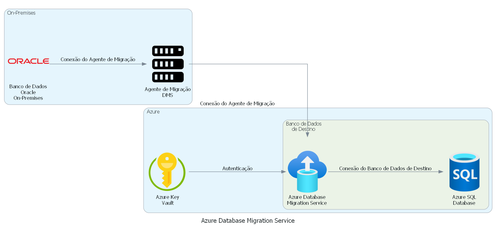

# Replicação na Cloud de Dados Oracle On-Premisses
Este projeto tem como objetivo apresentar três soluções para replicar dados de um banco Oracle on-premises para a nuvem, criando uma stage para integrações e APIs. As soluções propostas são: AWS Database Migration Service (DMS), Oracle GoldenGate e Azure Database Migration Service.

O objetivo é fornecer opções seguras, eficientes e escaláveis para manter os dados atualizados e disponíveis na nuvem, para uso em aplicações e análises. Cada solução oferece benefícios específicos, como alta disponibilidade, replicação em tempo real, integração com outros serviços de nuvem, entre outros.

A escolha da solução ideal depende das necessidades e requisitos específicos de cada projeto, como orçamento, tempo de migração, quantidade de dados a serem replicados, entre outros fatores. Com as três opções apresentadas, espera-se atender a diferentes cenários e demandas de replicação de dados na nuvem.

## Soluções Propostas
Foram apresentadas três soluções para a replicação dos dados: AWS Database Migration Service (DMS), Oracle GoldenGate e Azure Database Migration Service. Cada solução tem suas características específicas, vantagens e desafios. A escolha da solução dependerá das necessidades e restrições do projeto.

### Solução 1: AWS Database Migration Service (DMS)

**Descrição**:
O AWS Database Migration Service (DMS) é uma solução de replicação de banco de dados totalmente gerenciada que permite migrar dados para a AWS de forma contínua. A solução é capaz de replicar dados de diferentes fontes de dados, incluindo bancos de dados Oracle on-premises.

**Arquitetura**:
A arquitetura do AWS DMS é baseada em agentes que são instalados no servidor do banco de dados fonte e no servidor de destino. Os agentes capturam as mudanças no banco de dados fonte e as replicam no banco de dados de destino. O serviço é altamente escalável, permitindo a replicação de grandes volumes de dados com alta disponibilidade.

**Benefícios**:
Totalmente gerenciado pela AWS;
Alta escalabilidade;
Suporte a diversos bancos de dados, incluindo Oracle, Microsoft SQL Server, MySQL, entre outros.

**Desafios**:
Limitações na customização do processo de replicação;
Custo variável com base no tamanho dos dados replicados.

### Solução 2: Oracle GoldenGate

**Descrição**:
O Oracle GoldenGate é uma solução de replicação de dados de alto desempenho que permite a captura, transformação e entrega de dados de forma rápida e confiável. Essa solução é capaz de migrar dados em tempo real e é altamente escalável, podendo ser usada em ambientes de alta demanda.

**Arquitetura**:
A arquitetura do Oracle GoldenGate é baseada em um processo de captura de dados (extract), processo de transformação de dados (replicat) e a infraestrutura de entrega (manager) que coordena as operações de replicação. Na arquitetura de replicação, a aplicação cliente envia as transações para o banco de dados fonte, onde o processo extract do Oracle GoldenGate captura as mudanças. Em seguida, as mudanças são transmitidas para o banco de dados de destino, onde o processo replicat as aplica. O processo manager é responsável por gerenciar a replicação e monitorar o status de cada componente.

**Benefícios**:
Alta performance e escalabilidade;
Replicação de dados em tempo real;
Suporte a diversos bancos de dados, incluindo Oracle, Microsoft SQL Server, MySQL, entre outros.

**Desafios**:
Complexidade de configuração e gerenciamento;
Licenciamento pago.

### Solução 3: Azure Database Migration Service

**Descrição**:
O Azure Database Migration Service é um serviço de migração de dados totalmente gerenciado que permite mover bancos de dados de forma segura e confiável para a nuvem do Azure. Ele fornece uma plataforma para a execução de processos de migração de dados para mover bancos de dados para e de diferentes fontes de dados.

**Arquitetura**:
A arquitetura do Azure Database Migration Service envolve a criação de projetos de migração que permitem a execução de tarefas para mover bancos de dados em diferentes fontes de dados. Os projetos são criados usando componentes pré-configurados, como fontes de dados e destinos de dados. O Azure Database Migration Service oferece suporte a diversas fontes de dados, incluindo Oracle, SQL Server, MySQL, entre outros.

**Benefícios**:
Totalmente gerenciado pela Microsoft;
Segurança e confiabilidade na migração de dados;
Oferece suporte a diversas fontes de dados;
Permite a criação de projetos de migração personalizados;
Redução do tempo e esforço na migração de dados.

**Desafios**:
Configuração inicial pode ser complexa para usuários iniciantes;
Pode haver custos adicionais para a execução de projetos de migração em larga escala.

## Diagramas
Para cada solução, foram criados diagramas representando a arquitetura sugerida. Os diagramas foram criados usando a biblioteca Diagrams em Python e estão disponíveis na pasta "diagrams" neste repositório.

Para executar os códigos Python e visualizar os diagramas de cada solução, siga os seguintes passos:

- Clone o repositório para o seu computador;
- Certifique-se de ter o Python 3.6 ou superior instalado em seu sistema;
- Instale as bibliotecas necessárias, listadas no arquivo requirements.txt, executando o comando `pip install -r requirements.txt` no terminal;
- Abra o arquivo Python correspondente à solução desejada e execute-o no terminal com o comando `python nome_do_arquivo.py`.
- Os diagramas gerados serão salvos na pasta "diagrams" deste repositório e poderão ser visualizados em qualquer visualizador de imagem.

## Como Usar
Este projeto pode ser clonado ou baixado para uso como referência para a criação de soluções de replicação de dados em nuvem. É importante salientar que a escolha da solução deve ser feita com base nas necessidades e restrições específicas de cada projeto.

## Contribuição
Contribuições são bem-vindas! Se você tem sugestões, correções ou melhorias para este projeto, por favor, sinta-se à vontade para abrir uma issue ou pull request.

## Licença
Este projeto está sob a licença MIT.
