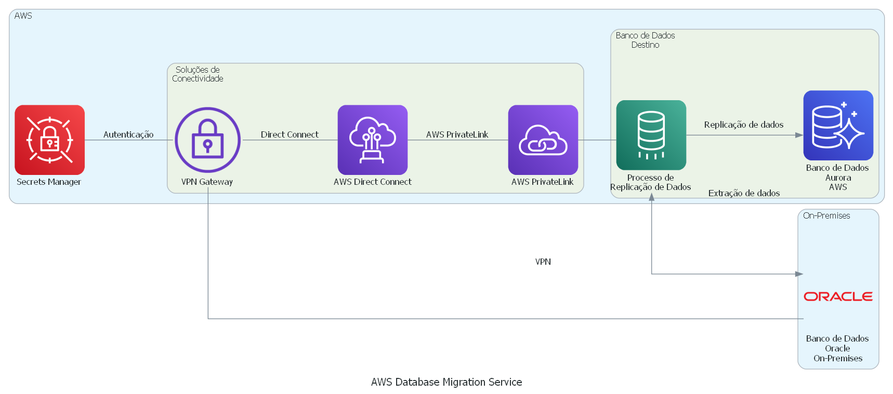

# Solução 1: AWS Database Migration Service (DMS)

**Descrição**:
O AWS Database Migration Service (DMS) é uma solução de replicação de banco de dados totalmente gerenciada que permite migrar dados para a AWS de forma contínua. A solução é capaz de replicar dados de diferentes fontes de dados, incluindo bancos de dados Oracle on-premises.

**Arquitetura**:
A arquitetura do AWS DMS é baseada em agentes que são instalados no servidor do banco de dados fonte e no servidor de destino. Os agentes capturam as mudanças no banco de dados fonte e as replicam no banco de dados de destino. O serviço é altamente escalável, permitindo a replicação de grandes volumes de dados com alta disponibilidade.

**Benefícios**:
- Totalmente gerenciado pela AWS;
- Alta escalabilidade;
- Suporte a diversos bancos de dados, incluindo Oracle, Microsoft SQL Server, MySQL, entre outros.

**Desafios**:
- Limitações na customização do processo de replicação;
  - Não é possível personalizar as transformações de dados durante o processo de replicação. O DMS suporta apenas transformações básicas, como conversões de tipo de dados e mapeamento de colunas.
  - A configuração de filtros pode ser limitada. Por exemplo, é possível filtrar tabelas com base em esquemas, tabelas específicas ou colunas, mas não é possível filtrar linhas específicas ou dados dentro de uma coluna.
  - A escolha dos tipos de dados suportados é limitada. O DMS suporta a replicação de vários tipos de dados, mas alguns tipos de dados, como BLOBs, podem não ser suportados.
  - A customização do processo de replicação pode ser limitada por fatores externos, como a velocidade da rede ou a capacidade de processamento do servidor de origem ou destino. Em alguns casos, é possível que o DMS não seja capaz de lidar com grandes volumes de dados ou complexas transformações de dados
- Custo variável com base no tamanho dos dados replicados.
