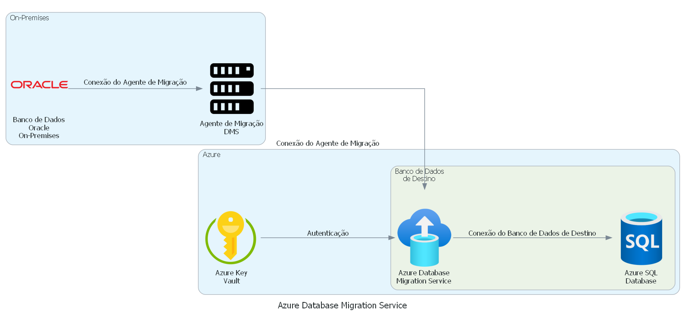

# Solução 3: Azure Database Migration Service

**Descrição**:
O Azure Database Migration Service é um serviço de migração de dados totalmente gerenciado que permite mover bancos de dados de forma segura e confiável para a nuvem do Azure. Ele fornece uma plataforma para a execução de processos de migração de dados para mover bancos de dados para e de diferentes fontes de dados.

**Arquitetura**:
A arquitetura do Azure Database Migration Service envolve a criação de projetos de migração que permitem a execução de tarefas para mover bancos de dados em diferentes fontes de dados. Os projetos são criados usando componentes pré-configurados, como fontes de dados e destinos de dados. O Azure Database Migration Service oferece suporte a diversas fontes de dados, incluindo Oracle, SQL Server, MySQL, entre outros.

**Benefícios**:
- Totalmente gerenciado pela Microsoft;
- Segurança e confiabilidade na migração de dados;
- Oferece suporte a diversas fontes de dados;
- Permite a criação de projetos de migração personalizados;
- Redução do tempo e esforço na migração de dados.

**Desafios**:
- Configuração inicial pode ser complexa para usuários iniciantes;
  - A configuração inicial do Azure Database Migration Service pode ser complexa, especialmente para usuários sem experiência prévia com o serviço ou com migração de dados em geral. É necessário entender bem as opções de configuração e as melhores práticas para evitar problemas durante a migração.
- Pode haver custos adicionais para a execução de projetos de migração em larga escala.
  - O Azure Database Migration Service é um serviço pago e pode haver custos adicionais para a execução de projetos de migração em larga escala. Além disso, dependendo das fontes e destinos de dados envolvidos na migração, pode haver custos de largura de banda e armazenamento na nuvem. Por isso, é importante avaliar cuidadosamente os custos envolvidos antes de iniciar um projeto de migração em larga escala.
