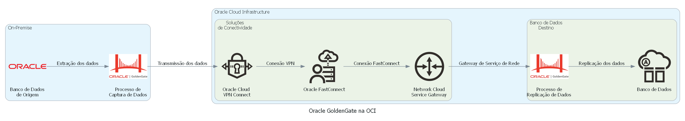

# Solução 2: Oracle GoldenGate

**Descrição**:
O Oracle GoldenGate é uma solução de replicação de dados de alto desempenho que permite a captura, transformação e entrega de dados de forma rápida e confiável. Essa solução é capaz de migrar dados em tempo real e é altamente escalável, podendo ser usada em ambientes de alta demanda.

**Arquitetura**:
A arquitetura do Oracle GoldenGate é baseada em um processo de captura de dados (extract), processo de transformação de dados (replicat) e a infraestrutura de entrega (manager) que coordena as operações de replicação. Na arquitetura de replicação, a aplicação cliente envia as transações para o banco de dados fonte, onde o processo extract do Oracle GoldenGate captura as mudanças. Em seguida, as mudanças são transmitidas para o banco de dados de destino, onde o processo replicat as aplica. O processo manager é responsável por gerenciar a replicação e monitorar o status de cada componente.

**Benefícios**:
- Alta performance e escalabilidade;
- Replicação de dados em tempo real;
- Suporte a diversos bancos de dados, incluindo Oracle, Microsoft SQL Server, MySQL, entre outros.

**Desafios**:
- Complexidade de configuração e gerenciamento;
- Licenciamento pago.
